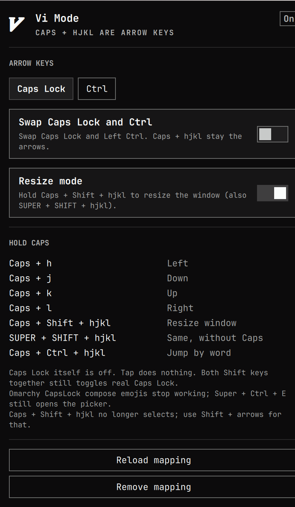

# Vi Mode



System-wide hjkl arrow keys for Omarchy 4. Pick **Caps Lock** or **Ctrl** as
the arrow layer, optionally swap Caps and Ctrl, and optionally resize windows
with the same hjkl chords.

There is no first-party Omarchy plugin for this. Hyprland keybinds can only
move windows. Real arrow keys in every app (editors, browsers, terminals)
have to be injected below the compositor. This plugin uses [keyd](https://github.com/rvaiya/keyd),
the same tool the Omarchy community already uses to remap Caps Lock.

Open the  panel and pick:

1. **Arrow keys** — hold **Caps Lock** or **Ctrl** with `h` / `j` / `k` / `l`
2. **Swap Caps Lock and Ctrl** — the two keys trade places; the arrow-layer
   key you chose stays on that physical key
3. **Resize mode** — hold the arrow-layer key + Shift + `hjkl` to resize the
   window (also SUPER + SHIFT + `hjkl`)

`omarchy plugin add` never runs install hooks or sudo, so the mapping is
applied by `install.sh`. Changing options in the panel writes
`~/.config/omarchy/oliverlukschander.vi-mode.json` immediately. Resize's
Hyprland binds apply without sudo. Arrow-layer and swap changes need
**Apply mapping** (sudo) so keyd can reload.

## Install

Both steps are required — `omarchy plugin add` cannot run sudo.

```sh
omarchy plugin add https://github.com/oliverlukschander/omarchy-vi-mode.git --enable
~/.config/omarchy/plugins/oliverlukschander.vi-mode/install.sh
```

`install.sh` asks for sudo: it installs `keyd`, writes `/etc/keyd/omarchy-vi-mode.conf`
(keeping other plugins' `# BEGIN` / `# END` blocks), enables the `keyd`
service, and marks keyd's virtual keyboard as internal in
`/etc/libinput/local-overrides.quirks` so the laptop touchpad is ignored
while typing. Log out once after the first install so Hyprland reloads
libinput.

Click the  icon in the bar, or *Setup → Vi Mode* in the Omarchy menu, and
use **Install mapping** if you would rather run that from a floating terminal.

## Usage

Hold the arrow-layer key (Caps Lock or Ctrl) and press:

| Keys | Caps Lock layer | Ctrl layer |
| --- | --- | --- |
| `h` `j` `k` `l` | Caps + hjkl → arrows | Ctrl + hjkl → arrows |
| Shift + `hjkl` | Caps + Shift + hjkl | Ctrl + Shift + hjkl |
| Word jump | Caps + Ctrl + hjkl | Ctrl + Alt + hjkl |

Tap Caps Lock does nothing when Caps is the arrow layer. Both Shift keys
together still toggles real Caps Lock (Omarchy's default
`shift:both_capslock_cancel`).

Ctrl as the arrow layer only remaps `h` / `j` / `k` / `l`. Other Ctrl chords
(copy, paste, `C-c`) still work. Right Ctrl is never remapped.

Swap + Ctrl layer is the common "Caps is Ctrl" setup: physical Caps Lock
becomes Ctrl, so Caps + `hjkl` are arrows and Caps + `c` is still `C-c`.

Omarchy's CapsLock compose emoji shortcuts (`CapsLock M S` and friends) stop
working while Caps is the arrow layer. `Super + Ctrl + E` still opens the
emoji picker.

Resize mode is the keyboard analog of SUPER + right-click drag. SUPER + J / K
/ L stay on Omarchy defaults (split, keybindings, layout). SUPER + SHIFT +
arrows still swap windows. The separate
[Vi Resize](https://github.com/oliverlukschander/omarchy-vi-resize) plugin is
no longer required; turn this option on instead. If that plugin is still
installed, SUPER + SHIFT + `hjkl` stays bound until you remove it.

## Remove

```sh
~/.config/omarchy/plugins/oliverlukschander.vi-mode/uninstall.sh
omarchy plugin remove oliverlukschander.vi-mode
```

Run the uninstaller first. Removing the plugin folder also deletes the
uninstaller. Other plugins that share `/etc/keyd/omarchy-vi-mode.conf` (Mac
Option) keep their `# BEGIN` / `# END` blocks. The libinput quirk is removed
the same way, leaving any unrelated sections in `local-overrides.quirks`.

## License and dependencies

MIT. See [LICENSE](LICENSE).

External runtime dependency: [keyd](https://github.com/rvaiya/keyd) (Arch package `keyd`).
`install.sh` installs it with `omarchy pkg add keyd`, writes `/etc/keyd/omarchy-vi-mode.conf`,
enables the `keyd` systemd service, and writes a libinput quirk so keyd still
pairs with the internal touchpad for disable-while-typing. That step asks for
sudo in a terminal; the plugin itself never runs sudo or install hooks.

## Why keyd

- Official keyd example is Caps + hjkl as arrows
- `[control]` overlays only hjkl, so Ctrl + C still works
- Works on Wayland, in GTK/Qt apps, terminals, and the lock screen
- Omarchy discussions and writeups already use keyd for Caps remaps
  ([#1383](https://github.com/basecamp/omarchy/discussions/1383),
  [sudomarchy](https://sudomarchy.com/posts/keyd-capslock-escape-app-launcher))

XKB (`omarchy-modifier-keys`) can turn Caps into Control or Escape, but it
cannot make Caps + hjkl send arrow keys.
